Task 1: Compute tree density by neighborhood (I)
================================================

In order to compute tree density by neighborhood you need two things.
You will need to know the area of the neighborhoods, which you will
compute in the next exercise. And you need the **tree counts by
neighborhood** which is the focus of this exercise.

You will produce counts of all trees by neighborhood in NYC and create a
single data frame with a column for total trees. The result should be a
data frame with **no geometry**.

Instructions
------------

-   Load `sf`, `raster`, and `dplyr` in your workspace.
-   Load `trees`, `neighborhoods`, `canopy`, and `manhattan` objects
    from Week 02 data folder
-   Use the `count()` function from `dplyr` on the `trees` object to
    compute total trees by neighborhood. The neighborhood variable is
    `hood`. Call the new object `tree_counts`.
-   Use `head()` to take a quick look at `tree_counts` and see if the
    geometry variable still exists.
-   Remove the geometry from your `tree_counts` data frame.
-   The default for the `count()` function is to name the count field
    n. Use the `rename()` function from dplyr to change the column
    called `n` to `tree_cnt`.
-   Use `hist()` to create a quick histogram of the tree counts.

``` r
# Load data and libraries
pacman::p_load(sf, raster, dplyr)

# Read in the trees shapefile
trees <- st_read("../../Week02/data/trees.shp")
```

    Reading layer `trees' from data source `C:\Users\z6hjb\OneDrive - KMD\projects\UNI\spatial_analytics_cds\Week02\data\trees.shp' using driver `ESRI Shapefile'
    Simple feature collection with 65217 features and 7 fields
    geometry type:  POINT
    dimension:      XY
    bbox:           xmin: -74.2546 ymin: 40.49894 xmax: -73.70078 ymax: 40.91165
    geographic CRS: WGS 84

``` r
# Read in the neighborhood shapefile
neighborhoods <- st_read("../../Week02/data/neighborhoods.shp")
```

    Reading layer `neighborhoods' from data source `C:\Users\z6hjb\OneDrive - KMD\projects\UNI\spatial_analytics_cds\Week02\data\neighborhoods.shp' using driver `ESRI Shapefile'
    Simple feature collection with 195 features and 5 fields
    geometry type:  MULTIPOLYGON
    dimension:      XY
    bbox:           xmin: -74.25559 ymin: 40.49612 xmax: -73.70001 ymax: 40.91553
    geographic CRS: WGS 84

``` r
# Read in the tree canopy single-band raster
canopy <- raster("../../Week02/data/canopy.tif")

# Read in the manhattan Landsat image multi-band raster
manhattan <- brick("../../Week02/data/manhattan.tif")

# Compute the counts of all trees by hood
tree_counts <- count(trees, nta)

# Take a quick look
plot(tree_counts)
```

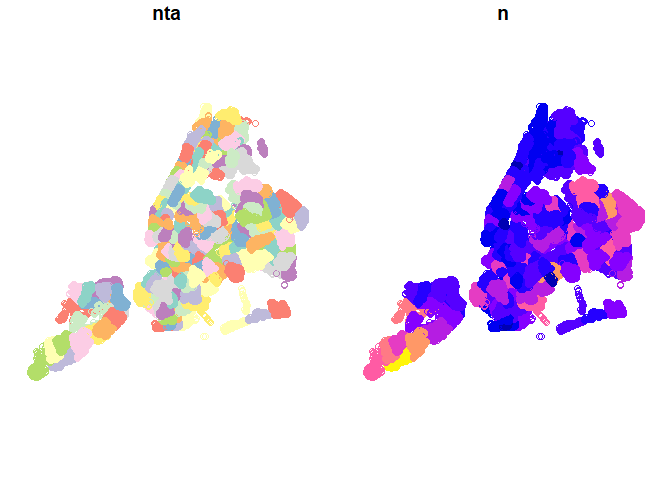

``` r
# Remove the geometry
tree_counts_no_geom <- st_drop_geometry(tree_counts)

# Rename the n variable to tree_cnt
tree_counts_renamed <- rename(tree_counts_no_geom, tree_cnt = n)

# Create histograms of the total counts
hist(tree_counts_renamed$tree_cnt)
```

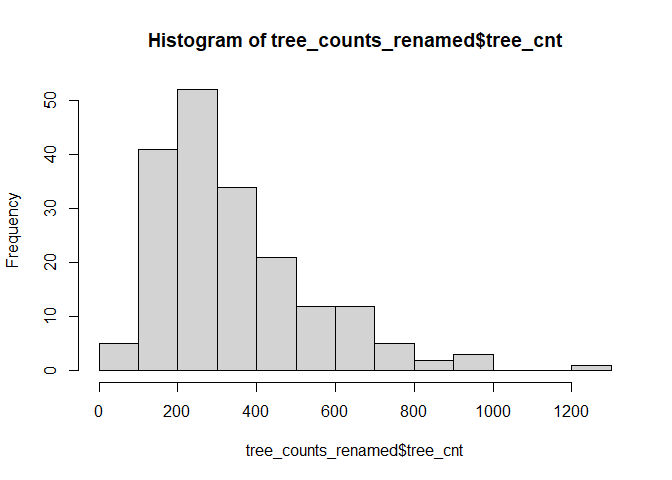

Great, you’ve completed the first step toward computing tree densities.
You now have tree counts by neighborhoods and in the next exercise
you’ll compute the neighborhood areas.

Task 2: Compute tree density by neighborhood (II)
=================================================

We have the tree counts (from the previous exercise). In this exercise
you will compute neighborhood areas, add them to the neighborhood `sf`
object and then you’ll join in the non-spatial tree counts data frame
from the previous exercise.

Instructions
------------

-   Compute the areas of the neighborhoods with `st_area()` and wrap
    them in the `unclass()` function to remove the units. Save this
    object as `areas`.
-   Use `mutate()` to add the areas to your neighborhoods object. Call
    the new variable `area`.
-   `left_join()` the `neighborhoods` object (which should now have
    areas) and the `tree_counts` object that you calculated in the last
    exercise.
-   Use `mutate()` with the given `ifelse()` code to replace `NA`s
    with 0.
-   Create a new column in `neighborhoods` called `tree_density` which
    is `tree_cnt/area`.

``` r
# Compute areas and unclass
areas <- unclass(st_area(neighborhoods))

# Add the areas to the neighborhoods object
neighborhoods_area <- mutate(neighborhoods, area = areas)

# Join neighborhoods and counts by shared columns (find the matching one in
# neighborhoods)
neighborhoods_counts <- left_join(neighborhoods_area, tree_counts_renamed, by = c(ntacode = "nta"))

# Replace NA values with 0 (lookup ifelse() function if needed)
neighborhoods_counts <- mutate(neighborhoods_counts, tree_cnt = ifelse(is.na(tree_cnt), 
    0, tree_cnt))

# Compute the density
neighborhoods_counts <- mutate(neighborhoods_counts, tree_density = tree_cnt/area)
```

You’re part way there. You have now computed the tree density variable
using, in part, the `sf` function `st_area()`. In the next exercises you
will compute the average tree canopy values and then compare.

Task 3: Compute average tree canopy by neighborhood
===================================================

In the previous exercises you computed tree density by neighborhood
using tree counts. In this exercise you will compute average tree canopy
by neighborhood as a percentage so that we can compare if the results
are similar.

Instructions
------------

-   Use `head()` to confirm that your `neighborhoods` object has the
    density results from the previous exercises.
-   Transform the CRS of the `neighborhoods` object to match the
    `canopy` object (load the latter if needed).
-   Convert the `neighborhoods` object to an `sp` object for use with
    the `raster` package.
-   Compute the mean of `canopy` values by neighborhood using
    `raster::extract()` with the argument fun = mean (this might take a
    minute).
-   Use `mutate`() to add a new column `avg_canopy` to neighborhoods,
    which is equal to `canopy_neighborhoods`.

``` r
# Confirm that you have the neighborhood density results
head(neighborhoods_counts)
```

    Simple feature collection with 6 features and 8 fields
    geometry type:  MULTIPOLYGON
    dimension:      XY
    bbox:           xmin: -74.00736 ymin: 40.61264 xmax: -73.77574 ymax: 40.8355
    geographic CRS: WGS 84
      county_fip boro_name ntacode            ntaname boro_code    area tree_cnt
    1        047  Brooklyn    BK88       Borough Park         3 5017229      565
    2        081    Queens    QN52      East Flushing         4 2736433      295
    3        081    Queens    QN48         Auburndale         4 3173995      507
    4        081    Queens    QN51        Murray Hill         4 4876380      732
    5        081    Queens    QN27      East Elmhurst         4 1832715      211
    6        005     Bronx    BX35 Morrisania-Melrose         2 1569317      214
                            geometry tree_density
    1 MULTIPOLYGON (((-73.97605 4... 0.0001126120
    2 MULTIPOLYGON (((-73.79493 4... 0.0001078046
    3 MULTIPOLYGON (((-73.77574 4... 0.0001597356
    4 MULTIPOLYGON (((-73.80379 4... 0.0001501114
    5 MULTIPOLYGON (((-73.8611 40... 0.0001151297
    6 MULTIPOLYGON (((-73.89697 4... 0.0001363650

``` r
# Transform the neighborhoods CRS to match the canopy layer
neighborhoods_crs <- st_transform(neighborhoods_counts, crs = crs(canopy, asText = TRUE))

# Convert neighborhoods object to a Spatial object (optional)
neighborhoods_sp <- as(neighborhoods_crs, "Spatial")

# Compute the mean of canopy values by neighborhood
canopy_neighborhoods <- raster::extract(canopy, neighborhoods_sp, fun = mean)

# Add the mean canopy values to neighborhoods
neighborhoods_avg_canopy <- mutate(neighborhoods_counts, avg_canopy = canopy_neighborhoods)
```

Excellent! Note that you transformed the neighborhoods object’s CRS.
This is actually not strictly necessary because `extract()` can
transform CRS on the fly. But it will be needed for plotting and other
operations later so doing manually is important here.

Task 4: Create plots using ggplot2
==================================

As an initial review of the data you created you will compute
correlations and create histograms and a scatter plot using `ggplot2`.

Instructions
------------

-   Load the `ggplot2` package.
-   Create a histogram of total tree density using `ggplot()` with
    `geom_histogram()`. The object is `neighborhoods_avg_canopy` and the
    variable is `tree_density`.
-   Create a histogram of average canopy (`avg_canopy`) using `ggplot()`
    with `geom_histogram()`.
-   Create a scatter plot of `tree_density` on the x-axis against
    `avg_canopy` on the y-axis using `ggplot()` and `geom_point()`. Also
    add a smooth using `stat_smooth()`.
-   Compute the correlation between tree density and average canopy with
    `cor()` by running the given code.

``` r
# Load the ggplot2 package
pacman::p_load(ggplot2)

# Create a histogram of tree density (tree_density)
ggplot(neighborhoods_avg_canopy, aes(x = tree_density)) + geom_histogram(color = "white")
```

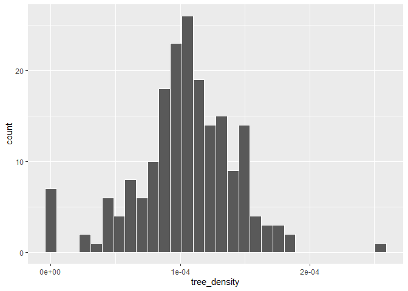

``` r
# Create a histogram of average canopy (avg_canopy)
ggplot(neighborhoods_avg_canopy, aes(x = avg_canopy)) + geom_histogram(color = "white")
```

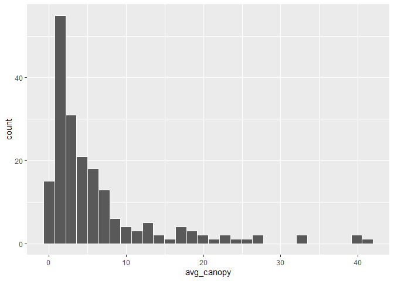

``` r
# Create a scatter plot of tree_density vs avg_canopy
ggplot(neighborhoods_avg_canopy, aes(x = tree_density, y = avg_canopy)) + geom_point() + 
    stat_smooth()
```

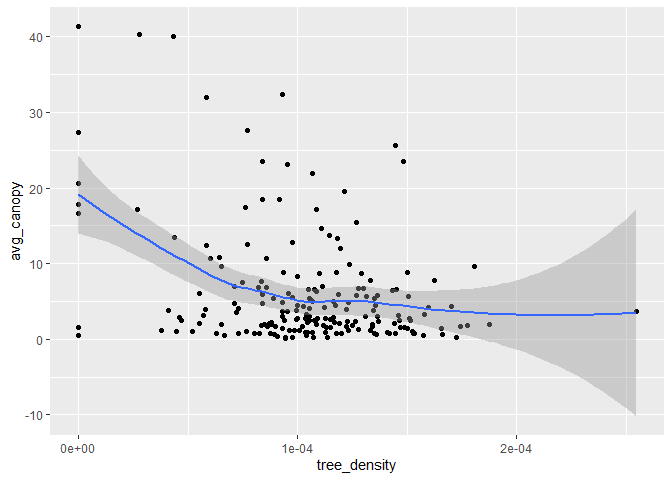

``` r
# Compute the correlation between density and canopy
cor(neighborhoods_avg_canopy$tree_density, neighborhoods_avg_canopy$avg_canopy)
```

               [,1]
    [1,] -0.3414462

Nice! Ggplot2 is great for creating data graphics and in the next
exercise you’ll see that you can use ggplot2 to make maps. In this case
the scatter plot and correlation suggest an unexpected result. If
anything, the street tree density data and tree canopy data are
negatively correlated. You will confirm this with maps in the next tasks
and you will learn why.

Task 5: Create a map using ggplot2
==================================

The `geom_sf()` function operates like any other layer in `ggplot2`
where you can link variables to aesthetics on the plot through the
`aes()` function. In a mapping context this might mean, for example,
creating a choropleth map by color coding the polygons based on a
variable. If you leave off the aesthetic mapping `geom_sf()` will map
the geometry alone.

`devtools::install_github("tidyverse/ggplot2")`

Instructions
------------

-   Ensure that `ggplot2` is loaded in your workspace and the CRS for
    both objects match (transform if needed. Note that there is no EPSG
    code, just a proj4string, for this CRS and this is fine.)
-   Use `ggplot()` and `geom_sf()` to create a map of `tree_density`
    using the default colors.
-   Use `ggplot()` and `geom_sf()` to create a map of `avg_canopy` using
    the default colors.
-   Alter the map of `tree_density` by changing the colors with
    `scale_fill_gradient()`. The hex codes (a `#` followed by numbers)
    for shades of green have been provided.
-   Alter the map of `avg_canopy` by changing the colors with
    `scale_fill_gradient()`. The hex codes (a `#` followed by numbers)
    for shades of green have been provided.

``` r
# Simplify name
neighborhoods <- neighborhoods_avg_canopy

# Plot the tree density with default colors
ggplot(neighborhoods) + geom_sf(aes(fill = tree_density))
```

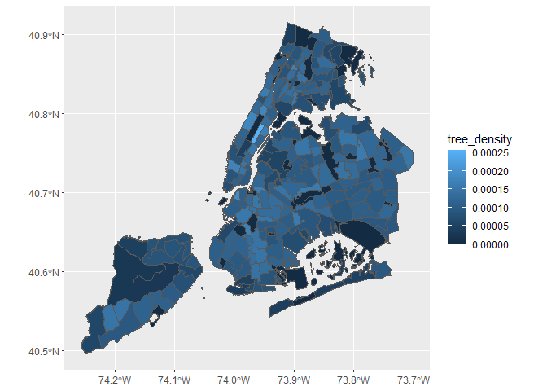

``` r
# Plot the tree canopy with default colors
ggplot(neighborhoods) + geom_sf(aes(fill = avg_canopy))
```

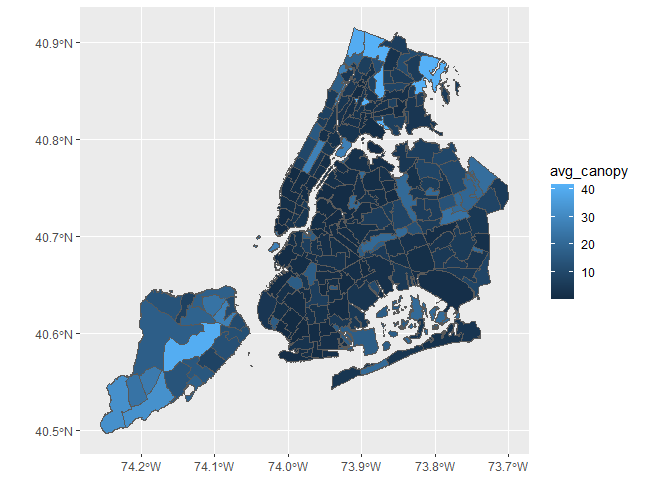

``` r
# Plot the tree density using scale_fill_gradient()
ggplot(neighborhoods) + geom_sf(aes(fill = tree_density)) + scale_fill_gradient(low = "#edf8e9", 
    high = "#005a32")
```

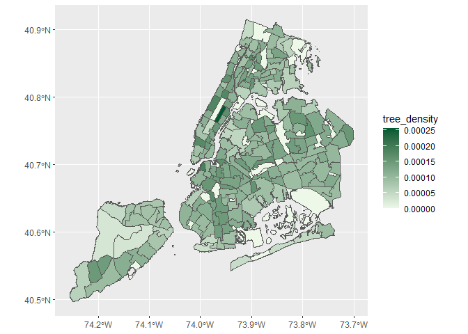

``` r
# Plot the tree canopy using the scale_fill_gradient()
ggplot(neighborhoods) + geom_sf(aes(fill = avg_canopy)) + scale_fill_gradient(low = "#edf8e9", 
    high = "#005a32")
```

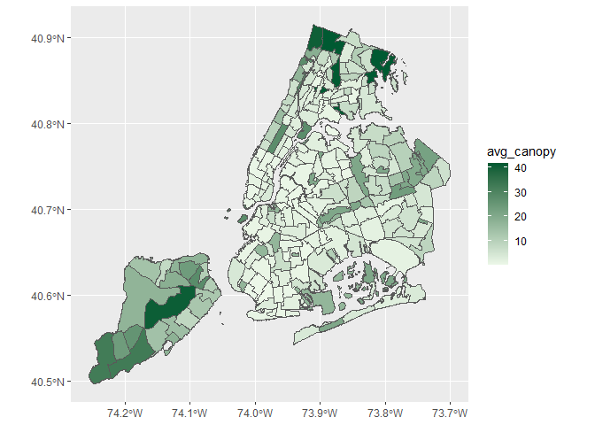

Great! You’re making progress in improving the graphics. The new layer
type `geom_sf()` is a big help for creating maps in `ggplot2`. Altering
the colors made the maps much more readable and you probably noticed
that they seem to show a different pattern. How about doing this with
`tmap`? See the next exercise.

Task 6: Create a map using tmap
===============================

The `tmap` package is an excellent tool for making maps. You’ll see that
it simplifies the process of binning your data values for nice maps and
makes it easy to stitch together different layers.

`tmap` operates similarly to `ggplot2` in the sense that it starts with
a function, in this case `tm_shape()`, to set up the map and then is
followed by layers and other instructions separated with the `+`.

Instructions
------------

-   Load `tmap` library in your workspace.
-   Use `tm_shape()` and `tm_polygons()` to create a map of
    `neighborhoods` with no color-coding.
-   Use `tm_shape()` and `tm_polygons()` to create a map of
    `neighborhoods` and color code by `tree_density`.
-   Create a new map by updating your neighborhoods map to include
    `palette = "Greens"` in `tm_polygons()`.
-   Create a similar map of the variable `avg_canopy` to include the
    following arguments in `tm_polygons()`:
    -   `style = "quantile"`
    -   `n = 7`.

``` r
# Load tmap library
pacman::p_load(tmap)

# Create a simple map of neighborhoods
tm_shape(neighborhoods) + tm_polygons()
```

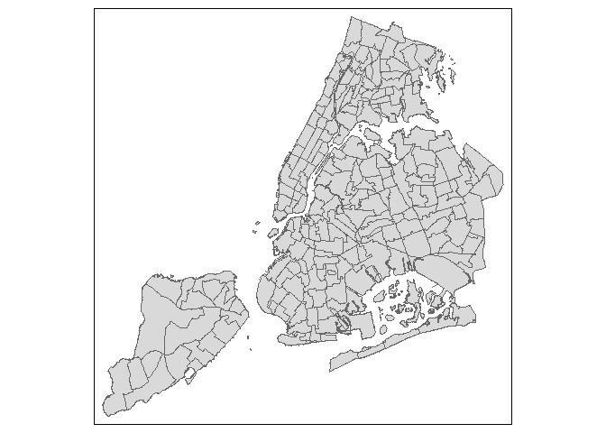

``` r
# Create a color-coded map of neighborhood tree density
tm_shape(neighborhoods) + tm_polygons("tree_density")
```

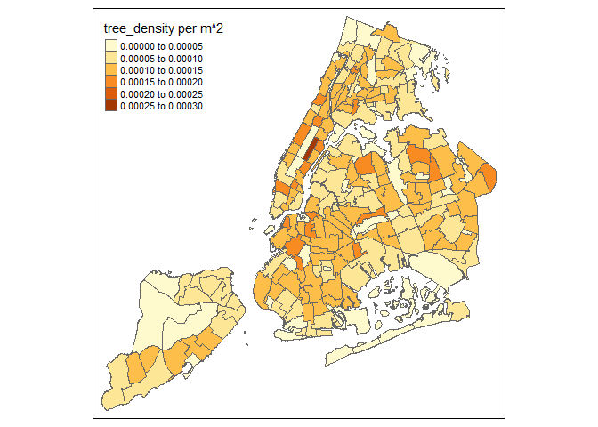

``` r
# Style the tree density map
tm_shape(neighborhoods) + tm_polygons("tree_density", palette = "Greens", style = "quantile", 
    n = 7, title = "Trees per sq. KM")
```

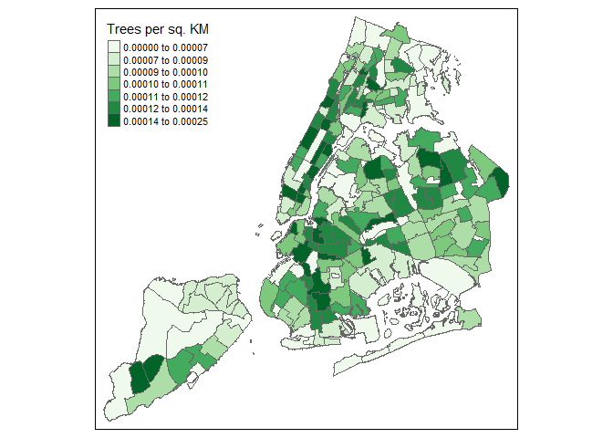

``` r
neighborhoods$avg_canopy <- as.numeric(neighborhoods$avg_canopy)  # Changing average canopy to numeric

# Create a similar map of average tree canopy
tm_shape(neighborhoods) + tm_polygons("avg_canopy", palette = "Greens", style = "quantile", 
    n = 7, title = "Average tree canopy (%)")
```

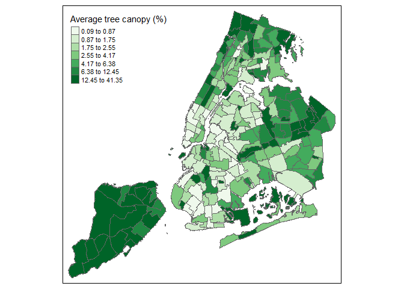

You can see the beauty of `tmap`. It makes nice maps in R relatively
easily and provides a lot of flexibility to alter your plot as needed

Task 7: Use tmap to create a final prettier(?) map
==================================================

In this exercise you will use `tmap` to create a final map with three
map views to help you to compare the green you see in an aerial photo
with the tree density and average canopy results you computed by
neighborhood. The question you’re trying to answer is which measure,
tree density or average tree canopy, more closely matches what you can
see in the aerial photo.

Note: In `map2`, you will make use of the `bbox` argument to force the
view extents to match the aerial photo.

Instructions 1/4
----------------

-   Remember to load `tmap`

1.  Create and view a map of the `manhattan` aerial image with
    `tm_shape()` and `tm_raster()`.

``` r
# Create a map of the manhattan aerial photo
manmap <- tm_shape(manhattan) + tm_rgb()
manmap
```

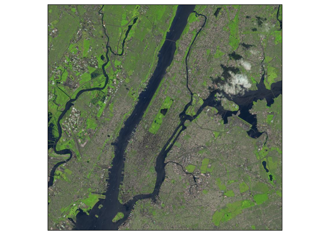

1.  Create and view a map of the `neighboorhoods` borders with
    `tm_shape()` and `tm_borders()`.

``` r
# Create a map of the neighborhood polygons
neighmap <- tm_shape(neighborhoods) + tm_borders(col = "black", lwd = 0.5, alpha = 0.5)
neighmap
```

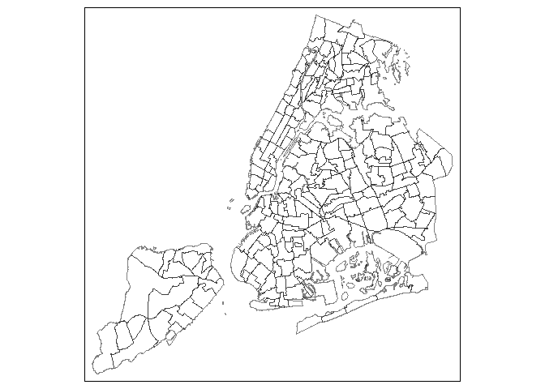

1.  Combine the `manhattan` and `neighborhoods` maps above with a `+`
    and save this as `map1` (the `neighborhoods` layer/map should be
    second).
2.  Create the second map of tree measures with `tm_shape()` and
    `tm_polygons()`.
3.  Combine the two maps with `tmap_arrange()`, use `asp = NA` to map
    height/width to match the bounding box.

``` r
# Your code goes below
map1 <- manmap + neighmap  # Combining the borders and the aerial view

tree_densitymap <- tm_shape(neighborhoods) + tm_polygons("tree_density", palette = "Greens", 
    style = "quantile", n = 7, title = "Trees per sq. KM")  # Creating tree density map

avg_canopymap <- tm_shape(neighborhoods) + tm_polygons("avg_canopy", palette = "Greens", 
    style = "quantile", n = 7, title = "Average tree canopy (%)")  # Creating average canopy map

tmap_arrange(tree_densitymap, map1, avg_canopymap, asp = NA)  # Arranging the three maps beside each other with the aerial view in the middle.
```

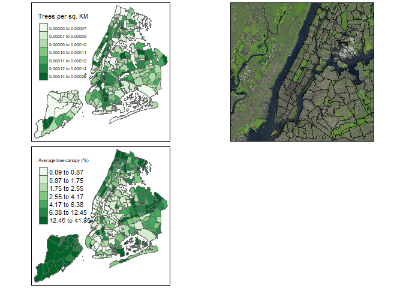

Congratulations! You’ve created a nice final map you can share with
colleagues to show how average tree canopy is a better representation of
green space than the tree density based on the Street Tree Census data
from NYC.
